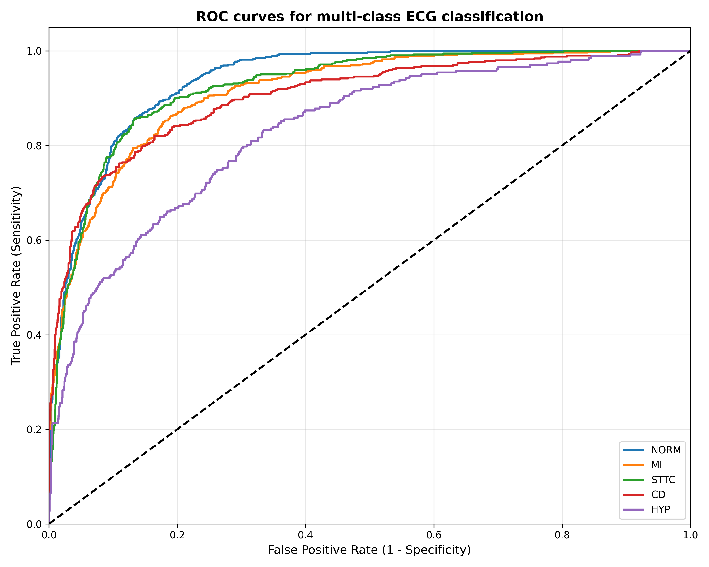
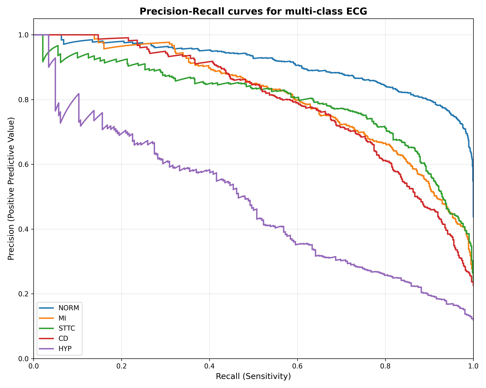
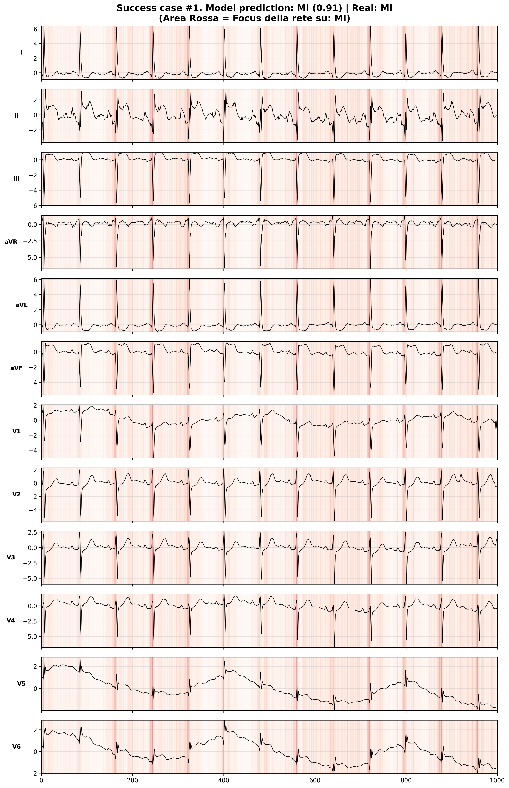

# 🫀 DeepECG: Explainable 1D-ResNet for Multi-Label ECG Diagnostics

[](https://www.python.org/downloads/)
[](https://pytorch.org/)
[](https://lightning.ai/)
[](https://physionet.org/content/ptb-xl/1.0.3/)
[](https://opensource.org/licenses/MIT)

**DeepECG** is an end-to-end Machine Learning Minimum Viable Product (MVP) that bridges clinical cardiology and software engineering. It utilizes a custom 1D Residual Neural Network (ResNet-1D) to automatically classify clinical 12-lead Electrocardiograms (ECGs) into five major diagnostic superclasses, providing **Explainable AI (XAI)** reports for clinical validation.

## ✨ Key Features
* **Multi-Label Classification:** Accurately mimics real-world clinical scenarios where patients present with multiple overlapping pathologies (e.g., Myocardial Infarction + Conduction Defect).
* **Automated Data Pipeline:** Built-in ingestion scripts to download, extract, and map the PTB-XL dataset (SCP-ECG standard codes to macro-categories) without manual intervention.
* **Optimized Training Engine:** Powered by PyTorch Lightning with persistent data workers, automated learning curve generation, and metric tracking (Macro-Average ROC-AUROC, PR-AUROC & F1-Score).
* **Clinical Interpretability (XAI):** Automatically generates high-resolution Vanilla Saliency Maps (Input Gradients) to visually highlight the specific morphological features (e.g., QRS complexes, ST segments) driving the model's predictions.

## 🔬 Dataset & Diagnostic Classes
The model is trained on the [PTB-XL Dataset](https://physionet.org/content/ptb-xl/1.0.3/), comprising over 21,000 clinical 10-second, 12-lead ECG records. Diagnoses are mapped into 5 superclasses:
1. `NORM`: Normal ECG
2. `MI`: Myocardial Infarction
3. `STTC`: ST/T Change
4. `CD`: Conduction Disturbance
5. `HYP`: Hypertrophy

## 🚀 Getting Started

### Prerequisites
Ensure you have Python 3.10+ installed. It is highly recommended to use a virtual environment (`venv` or `conda`).

### 1. Installation
Clone the repository and install the required dependencies:
```bash
git clone [https://github.com/MarcoSiro/Res1D-ECG.git](https://github.com/MarcoSiro/Res1D-ECG.git)
cd DeepECG
pip install torch torchvision torchaudio  # Use appropriate flags for CUDA/MPS support
pip install lightning torchmetrics pandas numpy matplotlib wfdb requests tqdm
```

### 2. Data Ingestion
Run the automated downloader to fetch and restructure the PTB-XL dataset (~2.7 GB):
```bash
python src/download_data.py
```

### 3. Run the Pipeline (Train & Test)
Execute the main script to start the PyTorch Lightning trainer. Upon completion, the script automatically tests the model and generates ROC curves and XAI reports in the `logs/` directory.
```bash
python src/main.py
```

## 📊 Baseline Results

After a rapid MVP training cycle (20 epochs), the ResNet-1D architecture establishes a highly discriminative baseline on the unseen test set:

| Metric | Score |
| :--- | :--- |
| **ROC-AUROC (Macro-Average)** | `0.9011` |
| **PR-AUROC (Macro-Average)** | `0.7570` |
| **F1-Score (Macro-Average)** | `0.6667` |

<details>
<summary><b>View Performance & XAI Graphics</b></summary>

<br>
<p align="center">
  
  <br><em>Figure 1: Receiver Operating Characteristic (ROC) curves per pathology.</em>
</p>

<br>
<p align="center">
  
  <br><em>Figure 2: Precison-Recall curves per pathology.</em>
</p>

<p align="center">
  
  <br><em>Figure 3: Automated XAI Report. Red zones indicate maximum network attention during a successful classification.
</p>
</details>

## 📁 Repository Structure

```text
DeepECG/
├── src/
│   ├── main.py              # Entry point: Training and testing orchestrator
│   ├── utilities.py         # ResNet1D, LightningModule, DataModule, and XAI logic
│   └── download_data.py     # Data fetching and restructuring script
├── data/                    # PTB-XL dataset (Auto-generated, git-ignored)
├── logs/                    # Automated outputs (Metrics, Loss curves, ROC, XAI)
├── assets/                  # ROC curve, PR curve and XAI examples 
├── .gitignore
└── README.md
```

## 👨‍⚕️ Author & License
**Marco Sironi** *Cardiology Resident & Health-Tech Developer*

This project is licensed under the MIT License - see the [LICENSE](LICENSE) file for details.